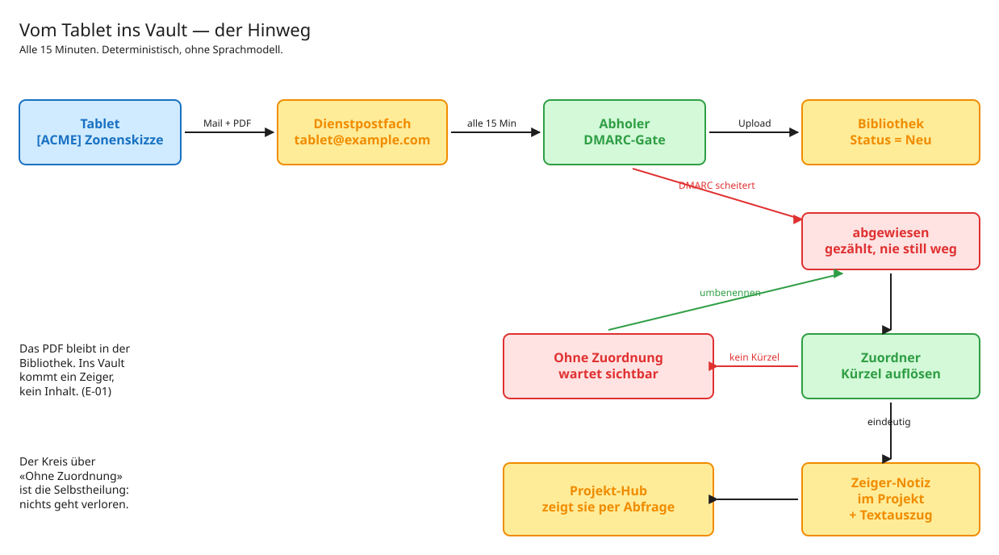

# Handschriftliche Notizen ins Zweitgehirn

Eine Strecke, die handgeschriebene Notizen von einem E-Ink-Tablet automatisch dem
richtigen Projekt in einem Markdown-Wissensspeicher zuordnet — über Microsoft 365,
ohne dass jemand etwas einsortiert.

Der Mensch schreibt auf dem Tablet und nennt das Dokument `[ACME] Zonenskizze`. Zwölf
Minuten später liegt im Ordner des Projekts ACME eine Notiz, die auf das PDF zeigt,
den Begleittext trägt und im Projekt-Dashboard auftaucht.

**Das ist Referenz-Code aus einem laufenden Betrieb**, herausgelöst und von allen
Bezügen auf die Infrastruktur befreit, in der er läuft. Er ist nicht als Bibliothek
gedacht, sondern zum Lesen, Verstehen und Nachbauen.

---

## Die Strecke in einem Bild

```
   Tablet                Postfach              SharePoint-Bibliothek        Vault
┌───────────┐        ┌─────────────┐         ┌──────────────────┐    ┌──────────────┐
│ [ACME]    │  Mail  │  Abholer    │  PDF +  │  Status = Neu    │    │ Notizen/     │
│ Zonen-    │ ─────► │  DMARC-Gate │ ──────► │  Kontext         │───►│ Zeiger-Notiz │
│ skizze.pdf│        │  alle 15Min │ Spalten │  Eingang         │    │ + Textauszug │
└───────────┘        └─────────────┘         └──────────────────┘    └──────────────┘
                            │                          ▲                     │
                       abgewiesen                      │                     ▼
                       (gezählt,                  Umbenennen           Projekt-Hub
                     nie still weg)             (Selbstheilung)      (Dashboard-Query)
```

Das PDF bleibt in SharePoint. Ins Vault kommt ein **Zeiger**, kein Inhalt.



## Was hier drin ist

| Teil | Programm | was es tut |
|---|---|---|
| **Hinweg** | `remarkable_abholer.py` | Postfach abfragen, DMARC prüfen, in die Bibliothek laden |
| | `remarkable_zuordner.py` | Kürzel auflösen, Zeiger-Notiz schreiben, Textauszug ziehen |
| **Routing** | `kuerzel_register.py` | das Kürzel-Register aus dem Vault bauen |
| **Aufsicht** | `remarkable_wachhund.py` | tote Links, liegengebliebene Dokumente, Stille |
| **Rückweg** | `remarkable_index.py` | Kürzel-Index als PDF zurück aufs Gerät |
| **Sprachnotiz** | `remarkable_sprachnotiz.py` | gesprochene Notiz mit der Zeichnung verknüpfen |
| **Schwestern** | `notiz_abholer.py` | dasselbe Muster für ein Mail-Postfach |
| | `ocr_nachlauf.py` | Text aus gescannten PDFs, mit Zeitbudget |
| **Unterbau** | `graph_basis.py` | Geheimnisse, Graph-Aufrufe, Fehlerklassen |

Dazu fünf Testproben, die ohne Zugang zu Microsoft 365 laufen.

## Die vier Ideen, auf denen alles steht

**1. Ein Kürzel in eckigen Klammern ist der Anker.** `[ACME] Thema` im Dateinamen —
Zeichenvergleich, kein Verstehen. Kein Modell, das aus dem Inhalt errät, wohin etwas
gehört. → [E-08](docs/entscheidungen/E-08%20Kuerzel%20in%20eckigen%20Klammern%20als%20Anker.md)

**2. Zeiger statt Inhalt.** Das PDF bleibt im Dokumentenspeicher, im Vault steht eine
Notiz mit Link. Keine zweite Wahrheit, die still veraltet.
→ [E-01](docs/entscheidungen/E-01%20Zeiger%20statt%20Inhalt.md)

**3. Es wird nie geraten.** Unbekanntes Kürzel heisst: das Dokument bleibt sichtbar
liegen. Nichts wird still verworfen — weder eine abgewiesene Mail noch ein Dokument
ohne Zuordnung. → [E-02](docs/entscheidungen/E-02%20Drei%20Klassen%20von%20Eingriffen.md)

**4. Stille bedeutet gesund.** Gemeldet wird bei Befund, nicht bei Erfolg. Ein Kanal,
der täglich «alles in Ordnung» sagt, wird nach zwei Wochen nicht mehr gelesen.
→ [E-06](docs/entscheidungen/E-06%20Stille%20bedeutet%20gesund.md)

## Wo anfangen

| Wenn du … | dann lies |
|---|---|
| verstehen willst, was das tut | [01 Überblick](docs/01%20Ueberblick%20—%20die%20Strecke.md) |
| das Routing-Konzept verstehen willst | [02 Vault und Kürzel](docs/02%20Das%20Vault%20—%20Struktur%20und%20Kuerzel.md) |
| es nachbauen willst | [09 Nachbau](docs/09%20Nachbau%20—%20Schritt%20fuer%20Schritt.md) |
| wissen willst, was schiefgehen kann | [10 Fallen](docs/10%20Fallen%20und%20Messungen.md) |
| eine Entscheidung hinterfragen willst | [docs/entscheidungen/](docs/entscheidungen/) |

## Was du brauchst

- Ein E-Ink-Tablet, das Dokumente per Mail versendet (hier: reMarkable) — oder
  irgendeine andere Quelle, die eine Mail mit PDF-Anhang schickt
- Microsoft 365 mit Administratorzugriff auf den Mandanten
- Eine Maschine, die alle 15 Minuten ein Python-Programm ausführen kann
- Python 3.11+, `pdftotext` (poppler-utils), `fpdf2`, für OCR zusätzlich `tesseract`

Keine Datenbank, kein Webserver, kein offener Port. Alles läuft ausgehend.

## Ehrliche Grenzen

- **Handschrift wird nicht erkannt.** Der Textauszug erfasst getippten Text; Handschrift
  ist im PDF eine Vektorzeichnung. Es gibt hier bewusst kein OCR für Handschrift.
  → [E-05](docs/entscheidungen/E-05%20Binaerdokumente%20durchsuchbar%20machen.md)
- **Der Rückweg hat kein Auto-Sync.** Das Tablet browst und importiert manuell.
- **Ohne Kürzel keine Zuordnung.** Das ist Absicht und die Schwachstelle zugleich: ein
  Tippfehler landet in «Ohne Zuordnung». Dagegen läuft der Kürzel-Index.
- **Der Code ist auf Deutsch**, Bezeichner und Kommentare. Er stammt aus einem
  deutschsprachigen Betrieb und wurde nicht übersetzt — eine Übersetzung hätte den
  Kommentaren mehr genommen, als sie an Reichweite gebracht hätte.

## Sanitisierung

Dieser Code lief produktiv. Vor der Veröffentlichung wurden Adressen, Pfade,
Kontonamen, Ticketnummern und Personennamen ersetzt — mit einem Skript, das im Repo
liegt: [`werkzeuge/sanitisieren.py`](werkzeuge/sanitisieren.py). Die Gegenprobe ist in
[10 Fallen](docs/10%20Fallen%20und%20Messungen.md#die-sanitisierung-selbst) dokumentiert,
samt der beiden Fehler, die sie zuerst produziert hat.

Es sind keine Zugangsdaten enthalten. Die Programme lesen ihre Geheimnisse zur Laufzeit
aus Umgebungsdateien, die nie im Repo liegen — Vorlagen dafür in
[`einrichtung/`](einrichtung/).

## Lizenz

MIT — siehe [LICENSE](LICENSE).
