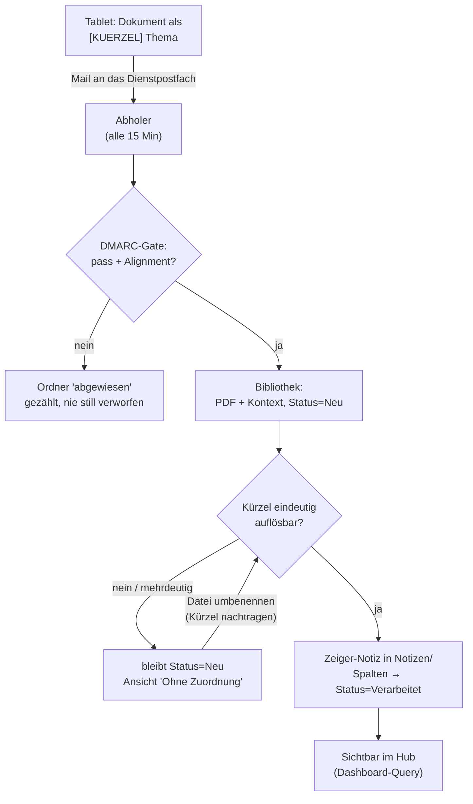

# 01 — Überblick: die Strecke

## Das Problem

Handschriftliche Notizen sind schnell erfasst und danach unauffindbar. Ein Stapel PDFs
in einem Cloud-Ordner ist ein Friedhof: Man weiss, dass etwas da ist, aber nicht wo,
und die Suche findet nichts, weil ein PDF seinen Text komprimiert speichert.

Die naheliegenden Lösungen tragen nicht:

| Ansatz | woran er scheitert |
|---|---|
| Ordnerstruktur beim Ablegen wählen | Auf dem Tablet gibt es keine Projektstruktur. Und wer beim Schreiben sortiert, schreibt weniger |
| Ein Modell liest den Inhalt und entscheidet | Handschrift ist im Export eine Vektorzeichnung — es gibt keinen Inhalt zu lesen |
| Automatik über Metadaten | Eine Mail vom Tablet trägt Betreff, Rumpf und Anhang. Keine Teilnehmer, keine Tags, keinen Kalenderbezug |

## Die Lösung in einem Satz

**Der Mensch setzt beim Benennen ein Kürzel in eckige Klammern; alles danach ist
Zeichenvergleich.**

```
[ACME] Zonenskizze
 ▲     ▲
 │     └── der Rest ist Thema, wird der Notiztitel
 └──────── das Kürzel, aufgelöst gegen ein Register aus dem Vault
```

Das ist die einzige Mitwirkung, die verlangt wird. Sie kostet drei Sekunden beim
Benennen und ersetzt das Einsortieren.

## Der Weg eines Dokuments



Dasselbe als Zeichnung, mit den Farben, die in allen Diagrammen dieselbe Bedeutung
tragen — blau kommt von aussen, grün ist Code, gelb ist Ablage, rot ist Abweisung:


*Bearbeitbar: [`diagramme/strecke-gesamt.excalidraw`](diagramme/strecke-gesamt.excalidraw)*

**Der Ohne-Zuordnung-Kreis ist die Selbstheilung.** Ein Dokument ohne gültiges Kürzel
geht nicht verloren, es wartet sichtbar. Umbenennen genügt — der nächste Lauf holt die
Notiz nach.

## Die fünf Schritte im Einzelnen

### 1. Das Tablet schickt eine Mail

Der Hersteller bietet «per Mail senden» aus der Dokumentansicht. Der Dateiname wird zum
Anhangsnamen, ein optionaler Begleittext zum Mailrumpf.

Das ist der ganze Transport. **Keine App, keine API des Herstellers, kein Konto bei
einem Zwischendienst.** Was das Tablet kann, ist eine Mail senden — und das genügt.

### 2. Der Abholer prüft, lädt hoch, räumt weg

Alle 15 Minuten, vier Schritte je Mail, in zwingender Reihenfolge:

```
1. prüfen      DMARC-Gate — was scheitert, geht nach 'abgewiesen'
2. kappen      Rumpf an der Signaturlinie schneiden, auf 4'000 Zeichen begrenzen
3. hochladen   Anhang + alle Spalten in EINEM Zug
4. wegräumen   Mail nach 'verarbeitet' — ERST nach Schritt 3
```

**Die Reihenfolge ist die Idempotenz.** Bricht der Lauf zwischen 3 und 4 ab, wiederholt
der nächste, statt zu verlieren. → [E-03](entscheidungen/E-03%20Zwei%20Fehlerklassen%20und%20die%20Reihenfolge.md)

Nach Schritt 3 hängt nichts mehr an der Mail. **Die Bibliothek ist selbsttragend** —
und genau deshalb kann ein Dokument Tage später noch zugeordnet werden.

### 3. Der Zuordner löst das Kürzel auf

Ebenfalls alle 15 Minuten, verkettet nach dem Abholer. Je Eintrag mit `Status = Neu`:

1. Kürzel aus dem **Dateinamen** lesen, ersatzweise aus dem Begleittext. Stehen beide
   da, **gewinnt der Name** — keine zwei Wahrheiten.
2. Gegen das Register auflösen. Unbekannt oder mehrdeutig heisst: keine Zuordnung.
3. Zeiger-Notiz in `<Ordner>/Notizen/` schreiben.
4. Textebene des PDFs ziehen und als Zitatblock anhängen.
5. Bibliotheks-Spalten nachziehen: `Projekt`, `Vault-Notiz`, `Status = Verarbeitet`.

### 4. Die Notiz macht das Dokument sichtbar

```yaml
---
typ: artefakt-zeiger
project: ACME
layer: roh
artefakt: https://…/Zonenskizze.pdf     # Link nach draussen, kein Wikilink
source: remarkable
provenance:
  origin: ingested-external              # Fremdinhalt, siehe E-04
---
```

Im Körper: der Begleittext als Zitatblock, der Textauszug als zweiter Zitatblock, ein
Link zum Dokument. Der Projekt-Hub zieht solche Notizen per Abfrage ein — der Mensch
pflegt dort nichts.

### 5. Der Wächter passt auf, was kein Lebenszeichen sieht

Nächtlich, drei Signale, meldet **nur bei Befund**:

| Signal | Schwelle |
|---|---|
| Tote `artefakt:`-Links | sofort |
| «Ohne Zuordnung», nicht repariert | ab 3 Tagen |
| Stiller Eingang | ab 14 Tagen |

## Was deterministisch ist — und was nicht

**Die ganze Hauptstrecke läuft ohne Sprachmodell.** Zeichenvergleich, HTTP, Dateien.

Ein Modell kommt an **genau einer** Stelle vor: im Sprachnotiz-Zweig, wenn eine
gesprochene Notiz zu mehreren Zeichnungen im selben Ordner passen könnte. Und auch dort
erst **ab zwei Kandidaten** — bei einem entscheidet der Code, bei null passiert nichts.

Das ist kein Sparzwang, sondern Auslegung: Ein Modell dort einzusetzen, wo es nichts zu
deuten gibt, heisst raten zu lassen, wo man vergleichen kann.

## Was die Strecke nicht tut

- Sie erkennt **keine Handschrift**.
- Sie **verschiebt nichts** im Vault und legt keine Projekte an.
- Sie **entscheidet nicht**, wohin ein Dokument ohne Kürzel gehört.
- Sie **synchronisiert nicht** zurück aufs Gerät — der Rückweg ist manueller Import.

## Weiter

- [02 — Das Vault: Struktur und Kürzel](02%20Das%20Vault%20—%20Struktur%20und%20Kuerzel.md)
- [03 — Microsoft 365 einrichten](03%20Microsoft%20365%20—%20die%20Einrichtung.md)
