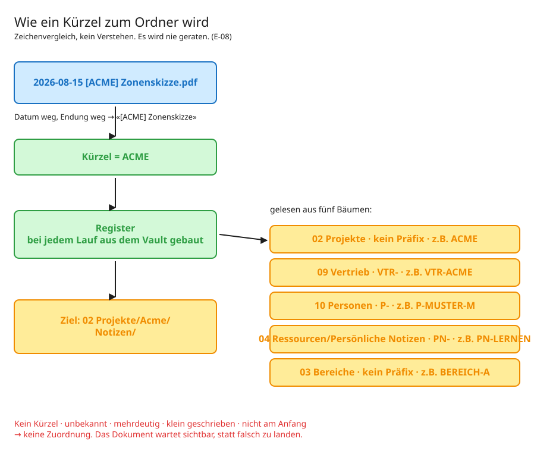

# 02 — Das Vault: Struktur und Kürzel

> Ohne diesen Teil funktioniert die Strecke nicht. Die Zuordnung ist kein Kunststück
> der Software, sondern eine Folge davon, **wie das Vault aufgebaut ist**.

## Was ein Vault hier ist

Ein Verzeichnis mit Markdown-Dateien, versioniert in Git, gelesen von einem
Notiz-Programm (hier Obsidian, aber das ist austauschbar). Keine Datenbank, kein
Server. Eine Datei ist eine Notiz, ein Ordner ist eine Sache.

## Die Ordnung: PARA, plus zwei Schichten

Die oberste Ebene folgt PARA — Projekte, Bereiche, Ressourcen, Archiv:

```
00 Kontext/          wer ich bin, wie gearbeitet wird — Regeln, die gelten
01 Inbox/            unsortierte Gedanken
02 Projekte/         Vorhaben mit Ziel und Enddatum
03 Bereiche/         laufende Verantwortung ohne Enddatum
04 Ressourcen/       Referenzmaterial, Recherchen
05 Daily Notes/      Tageslogbuch
06 Archiv/           abgeschlossen
07 Anhänge/          Bilder, PDFs
08 Meeting Inbox/    Warteraum für Unzuordenbares
09 Vertrieb/         alles vor dem Auftrag
10 Personen/         Menschen mit eigenen Gesprächen
```

Quer dazu liegt eine zweite Ordnung, die für die Strecke wichtiger ist:

| Schicht | Inhalt | Anspruch | Volumen |
|---|---|---|---|
| **Roh** | Inbox, Tagesnotizen, Meeting-Mitschriften, **Zeiger-Notizen dieser Strecke** | volumentolerant, durchsuchbar | unbegrenzt |
| **Kuratiert** | Kontext-Dateien, Landkarten, Synthesen, Entscheidungen | hoch, kontrolliert | bewusst klein |

**Was diese Strecke erzeugt, ist Roh-Schicht.** Eine Zeiger-Notiz ist eine Ablage, kein
Wissen. Sie wird nicht kuratiert, nur auffindbar gemacht.

## Der Kern: das Kürzel

Jeder Ordner, dem etwas zugeordnet werden kann, hat eine **Hub-Datei**, und die trägt
ihr Kürzel im Frontmatter:

```yaml
---
typ: projekt
meeting_key: ACME          # ← das ist der Anker
status: aktiv
---
```

Die Strecke liest genau dieses Feld. Steht es nicht da, ist der Ordner unsichtbar — es
gibt nichts, wogegen sich ein Name auflösen liesse.

### Fünf Bäume, vier Präfixe

| Baum | Präfix | Beispiel | wofür |
|---|---|---|---|
| `02 Projekte` | keines | `ACME` | Vorhaben mit Ziel und Enddatum |
| `09 Vertrieb` | `VTR-` | `VTR-ACME` | alles vor dem Auftrag |
| `10 Personen` | `P-` | `P-MUSTER-M` | Menschen mit eigenen Gesprächen |
| `04 Ressourcen/Persönliche Notizen` | `PN-` | `PN-LERNEN` | Themen ohne Projektcharakter |
| `03 Bereiche` | keines | `BEREICH-A` | laufende Verantwortung |

Die Präfixe sind **keine Technik, sondern Lesbarkeit**: Wer `[VTR-ACME]` auf dem Tablet
tippt, weiss, dass es um einen Lead geht und nicht um das laufende Projekt beim selben
Kunden. Für den Zeichenvergleich wäre es egal.

**Warum überhaupt getrennte Bäume?** Weil ein Lead kein Projekt ist: Ein Projekt hat ein
Commitment und ein Enddatum, ein Lead hat eine Wahrscheinlichkeit und kann sterben.
Mischt man beides, wird die Projektliste unehrlich. Und ein Bereich endet nie — er wird
deshalb nicht zum Projekt, nur weil er ein Kürzel braucht.




*Bearbeitbar: [`diagramme/kuerzel-routing.excalidraw`](diagramme/kuerzel-routing.excalidraw)*
### Das Register wird gebaut, nicht gepflegt

```python
REGISTER_WURZELN = ("02 Projekte", "09 Vertrieb", "10 Personen",
                    "04 Ressourcen/Persönliche Notizen", "03 Bereiche")
```

`kuerzel_register.py` durchläuft diese Wurzeln bei **jedem Lauf**, liest die ersten
4'096 Bytes jeder `.md` und sammelt `meeting_key` und `lead_key` ein.

**Es gibt bewusst keine zweite gepflegte Liste.** Zwei Listen driften auseinander, und
dann ist unklar, welche gilt. Das Vault ist der Index.

> **Falle:** Ein Baum, der nicht in `REGISTER_WURZELN` steht, ist unsichtbar — seine
> Kürzel laufen ins Leere, und die Dokumente landen im Warteraum, **ohne dass jemand
> einen Fehler sieht**. Zwei Bäume waren aus genau diesem Grund monatelang tot: Die
> Hubs trugen ihre Kürzel korrekt, aber die Wurzel fehlte in dieser Zeile.

### Kollisionen werden gemeldet, nicht aufgelöst

Zwei Ordner mit demselben Kürzel machen jede Zuordnung mehrdeutig. Das Register meldet
das als Befund — und die betroffenen Kürzel ordnen **nichts** mehr zu. Lieber ein
Dokument im Warteraum als eines im falschen Projekt.

Ebenso bei Präfix-Mehrdeutigkeit: Ist `ACME` vergeben **und** `ACME-NORD`, dann ist
`[ACME]` mehrdeutig und wird abgelehnt.

## Wo die Notiz landet

```
02 Projekte/Acme Skizze/
├── Acme Skizze - HUB.md          ← trägt meeting_key: ACME
├── Projekt-Governance.md
├── Meetings/
├── Decisions/
└── Notizen/                            ← hierhin schreibt die Strecke
    └── 2026-08-15 [ACME] Zonenskizze.md
```

`Notizen/` entsteht **beim ersten Dokument**, nicht auf Vorrat. Bei Personen gilt das
sogar für den ganzen Ordner: Eine Person, die bisher nur eine flache Kontaktnotiz hat,
bekommt ihren Ordner beim ersten Dokument, und die Kontaktnotiz zieht als Hub um
(`vault_baeume.py`).

**Warum nicht auf Vorrat:** Ein Ordner je Kontakt wäre ein Baum voller leerer Hülsen.
Das Kürzel dagegen trägt die Kontaktnotiz von Anfang an — es ist sofort benutzbar,
bevor es den Ordner gibt.

## Sichtbar wird es über eine Abfrage

Im Projekt-Hub steht ein Block, der die Zeiger-Notizen einsammelt:

````markdown
## Handschriftliche Notizen

```dataview
LIST file.link
FROM "02 Projekte/Acme Skizze/Notizen"
WHERE typ = "artefakt-zeiger"
SORT file.name DESC
```
````

**Schreiben im Ursprung, der Hub zeigt nur.** Nichts wird kopiert. Ohne diesen Block
wäre die Notiz zwar abgelegt, aber im Hub unsichtbar.

## Die Namensregel, die der Mensch kennen muss

```
[KUERZEL] Thema              Dokument auf dem Tablet
[KUERZEL] NOTIZ Thema        gesprochene Notiz dazu
```

Mehr nicht. Diese zwei Zeilen stehen deshalb oben auf dem Kürzel-Index, der nächtlich
aufs Gerät zurückgeht → [05 Rückweg](05%20Der%20Rueckweg%20—%20Index%20aufs%20Geraet.md).

## Es wird nie geraten

| Eingabe | Ergebnis |
|---|---|
| `[ACME] Zonenskizze` | zugeordnet |
| `Zonenskizze` | Warteraum — kein Kürzel |
| `[ZZZZ] Thema` | Warteraum — nicht im Register |
| `[acme] Thema` | Warteraum — Kürzel müssen gross sein |
| `Notiz [ACME] Thema` | Warteraum — Kürzel nicht am Anfang |
| `[ACME]` | Warteraum — kein Thema |

Weder Ähnlichkeit noch Teiltreffer. **Ein unbekanntes Kürzel ist ein Befund, keine
Einladung zur Interpretation.**
