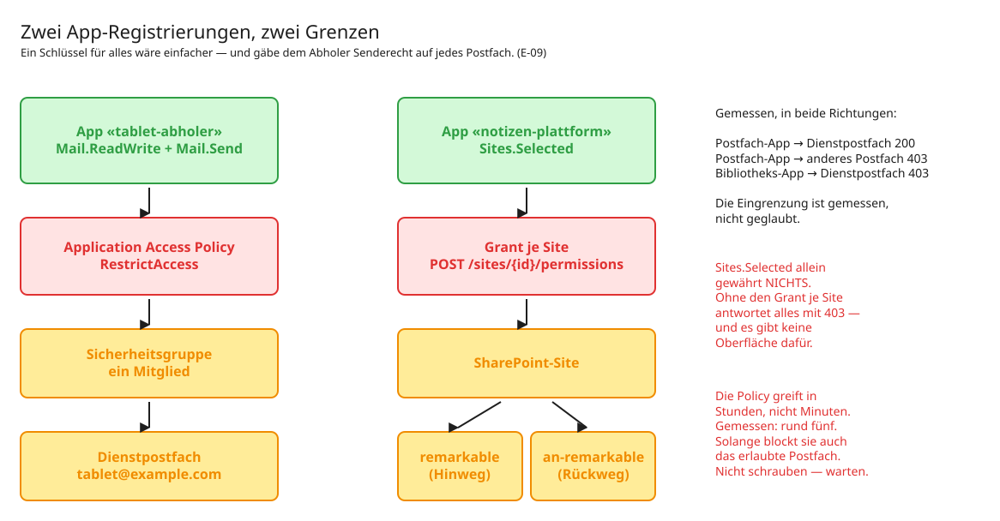

# 03 — Microsoft 365: die Einrichtung

Dieser Teil ist der aufwendigste am ganzen Nachbau — nicht weil er kompliziert wäre,
sondern weil an drei Stellen etwas anders funktioniert, als die Dokumentation vermuten
lässt. Diese drei Stellen sind hier benannt.

## Das Zielbild

```
Microsoft-365-Mandant
│
├── Dienstpostfach  tablet@example.com          (Shared Mailbox, keine Lizenz)
│   ├── Posteingang
│   ├── verarbeitet          ← auf WURZEL-Ebene, nicht im Posteingang
│   └── abgewiesen
│
├── Sicherheitsgruppe  sec-tablet-postfach@…    (mail-aktiviert, ein Mitglied)
│       └── nur als Anker für die Access Policy
│
├── App «tablet-abholer»          → Mail.ReadWrite, Mail.Send
│       └── Access Policy: NUR das Dienstpostfach
│
├── App «notizen-plattform»       → Sites.Selected
│       └── Grant: NUR eine Site
│
└── SharePoint-Site «Automation»
    ├── Bibliothek  remarkable      (Hinweg, 5 Spalten, 3 Ansichten)
    └── Bibliothek  an-remarkable   (Rückweg, flach)
```

**Zwei Apps, nicht eine.** Die Begründung steht in
[E-09](entscheidungen/E-09%20Zwei%20App-Registrierungen%20statt%20einer.md) und ist kurz:
Die Postfach-App braucht `Mail.Send`. Eine mandantenweite Erteilung hiesse, dieser
Schlüssel kann als **jede Person im Haus** senden. Die Access Policy schnürt sie auf
ein Postfach ein — eine physische Grenze, keine Regel.



*Bearbeitbar: [`diagramme/m365-architektur.excalidraw`](diagramme/m365-architektur.excalidraw)*

---

## Schritt 1 — Dienstpostfach

Im Exchange Admin Center ein **Shared Mailbox** anlegen: keine Lizenz nötig, das
zugehörige Konto ist anmeldegesperrt.

Zwei Unterordner anlegen: `verarbeitet` und `abgewiesen`.

> **Falle:** Die Ordner gehören auf **Wurzel-Ebene neben den Posteingang**, nicht
> hinein. Outlook verschachtelt sie beim Anlegen gern in den Posteingang; über Graph
> lässt sich das korrigieren. Der Abholer legt fehlende Ordner ohnehin selbst nach —
> aber er legt sie dort an, wo er sie erwartet.

## Schritt 2 — App-Registrierung, noch ohne Rechte

In Entra ID eine App registrieren (`tablet-abholer`), **keine Berechtigungen setzen**,
Application-ID notieren.

**Die Reihenfolge ist der Punkt.** Wer erst `Mail.ReadWrite` erteilt und danach die
Policy baut, hat ein Zeitfenster — in der Praxis Stunden — in dem die App
**mandantenweiten Postfachzugriff** hat. Erst der Käfig, dann das Tier.

## Schritt 3 — Sicherheitsgruppe und Access Policy

> **Falle:** Eine Shared Mailbox ist **kein Sicherheitsprinzipal**. Der direkte Weg
> scheitert mit «Die Identität des Richtlinienbereichs ist kein Sicherheitsprinzipal».
> Der Umweg führt über eine **mail-aktivierte Sicherheitsgruppe** mit dem Postfach als
> einzigem Mitglied.

In Exchange Online PowerShell:

```powershell
New-DistributionGroup -Type Security `
  -Name "sec-tablet-postfach" `
  -PrimarySmtpAddress sec-tablet-postfach@example.com `
  -Members tablet@example.com

New-ApplicationAccessPolicy `
  -AppId <Application-ID> `
  -PolicyScopeGroupId sec-tablet-postfach@example.com `
  -AccessRight RestrictAccess `
  -Description "Abholer darf ausschliesslich das Dienstpostfach"

# Beide Richtungen prüfen:
Test-ApplicationAccessPolicy -Identity tablet@example.com  -AppId <ID>   # Gewährt
Test-ApplicationAccessPolicy -Identity eigner@example.com  -AppId <ID>   # Verweigert
```

> **Falle, und die teuerste:** **Die Policy greift in Etappen, und das dauert Stunden,
> nicht Minuten.** Microsoft nennt «bis zu 30 Minuten»; für gruppenbasierte Policies
> sind bis zu 24 Stunden dokumentiert. Gemessen wurden **rund fünf Stunden**.
>
> In der Zwischenzeit blockt die Policy **auch das eigene, erlaubte Postfach**, weil
> die Gruppenmitgliedschaft an der Durchsetzungsschicht noch leer auflöst. Und:
> `Test-ApplicationAccessPolicy` sagt längst das Richtige, während der echte
> Graph-Aufruf noch mit 403 antwortet.
>
> **Nicht reparieren, nicht umbauen — warten und messen.** Wer hier schraubt,
> verschlimmert. Höchstens *eine* gezielte Änderung (das Gruppenmitglied einmal
> entfernen und neu hinzufügen, um ein frisches Replikationsereignis zu erzeugen),
> dann wieder messen.

## Schritt 4 — Erst jetzt die Rechte

Als **Anwendungsberechtigung** (nicht delegiert), mit Administratorzustimmung:

| App | Rolle | wofür |
|---|---|---|
| `tablet-abholer` | `Mail.ReadWrite` | Postfach lesen, Mails verschieben |
| | `Mail.Send` | Sammelmeldung aus dem Dienstpostfach |
| `notizen-plattform` | `Sites.Selected` | die Bibliotheken |

Client-Secret erzeugen — die Spalte **«Wert»**, nicht die ID — und in die
Umgebungsdatei legen. Rotationsdatum als Kommentar dazuschreiben; es gibt keine
Erinnerung, die von selbst kommt.

## Schritt 5 — Gegenproben, per Graph und nicht nur per Cmdlet

```
Postfach-App    → Dienstpostfach          erwartet 200
Postfach-App    → Postfach einer Person   erwartet 403
Bibliotheks-App → Dienstpostfach          erwartet 403
```

**Beide Richtungen, jedes Mal.** Eine Absicherung, die nur in eine Richtung gemessen
ist, ist eine Annahme.

> **Die Lektion, die diese Zeile teuer gemacht hat:** In einem Fall wurden zwei Rollen
> im Portal entzogen. Acht Tage später standen **beide weiterhin im Token** — der
> Entzug hatte nicht gegriffen, und niemand hatte es bemerkt. Dazu trug das Token eine
> dritte Rolle, die in keiner Liste stand.
>
> **Ein Entzug ohne Nachmessung ist eine Absicht, keine Änderung.** Das Portal ist
> nicht das Token. Deshalb liegt im Betrieb eine Soll-Liste der Rollen neben dem Code,
> und ein Job vergleicht sie täglich mit dem `roles`-Anspruch eines frisch geholten
> Tokens — in **beiden** Richtungen: zu viel und zu wenig sind beides Befunde.

Vorlage dafür: [`einrichtung/graph-rollen-soll.txt`](../einrichtung/graph-rollen-soll.txt)

## Schritt 6 — SharePoint-Site und Grant

Eine Site genügt für beide Bibliotheken. Der `Sites.Selected`-Grant wird **pro Site**
über Graph gesetzt:

```http
POST /sites/{site-id}/permissions
{
  "roles": ["write"],
  "grantedToIdentities": [{ "application": { "id": "<app-id>", "displayName": "…" }}]
}
```

> **Falle:** `Sites.Selected` **allein gewährt nichts**. Ohne diesen Aufruf antwortet
> jeder Zugriff mit 403, und es gibt **keine Oberfläche** dafür — nur die API.

## Schritt 7 — Bibliothek und Spalten, von Hand

> **Falle:** `Sites.Selected` erlaubt **keine Schema-Änderungen**. Dateien und
> Spaltenwerte schreiben: ja. Spalten anlegen: 403. Eine Bibliothek anlegen: ebenfalls
> 403 (`accessDenied`).
>
> Die Referenzmessung im selben Lauf — Bibliotheken derselben Site **auflisten** mit
> demselben Token — lieferte 200. Es fehlt also die Berechtigung, nicht das Werkzeug.
> Ohne diese Gegenprobe hätte man ebenso gut auf einen Bug tippen können.

Bibliothek `remarkable`, flach, keine Ordner. **Fünf Spalten:**

| Spalte | Typ | interner Name |
|---|---|---|
| Projekt | Text, einzeilig | `Projekt` |
| Status | Auswahl: Neu / Verarbeitet / Fehler, Standard **Neu** | `Status` |
| Kontext | Text, mehrzeilig | `Kontext` |
| Vault-Notiz | **Text**, einzeilig | `Vault_x002d_Notiz` |
| Eingang | Datum **und Uhrzeit** | `Eingang` |

> **Falle:** `Vault-Notiz` ist eine **Textspalte**, obwohl inhaltlich ein Link
> darinsteht. Graph kann **Hyperlink-Spalten nicht beschreiben** (v1.0, mit Objekt-
> und String-Format geprüft), und die SharePoint-REST-Schnittstelle als Ausweichweg
> verlangt Zertifikats-Authentifizierung — mit Client-Secret kommt pauschal 401.
>
> Wer hier eine Link-Spalte einplant, baut eine Spalte, die kein Job füllen kann.

> **Falle:** Der Bindestrich im internen Namen. SharePoint kodiert ihn zu `_x002d_`.
> Und beim **Anlegen einer Bibliothek** streicht es ihn aus dem internen Namen ganz
> (`displayName` `an-remarkable` → `name` `anremarkable`). Der Code löst deshalb über
> beide Namen auf.

**Drei Ansichten:**

| Ansicht | Filter | wozu |
|---|---|---|
| **Neu** | `Status = Neu` | was noch aussteht |
| **Nach Projekt** | gruppiert nach `Projekt` | Überblick |
| **Ohne Zuordnung** | `Projekt` ist leer, zeigt `Kontext` | **die Arbeitsliste** |

**Alle Spalten schreibt der Job.** Der Mensch repariert durch **Umbenennen der Datei**,
nie über die Spalten — sonst entstehen zwei Wahrheiten.

## Schritt 8 — Rückweg-Bibliothek

Zweite Bibliothek `an-remarkable`, flach, keine Spalten, keine Ansichten. Bewusst
getrennt, damit Hin- und Rückweg nicht vermischen.

Dann einmalig in der Bibliothek **«Verknüpfung zu OneDrive hinzufügen»** klicken.

> **Falle, am Gerät gemessen:** Die Tablet-Integration zeigt **keine
> SharePoint-Sites** — auch eine seit Tagen bestehende Bibliothek nicht. Die Annahme,
> das Gerät browse Sites direkt, ist widerlegt. Der Weg führt über die
> OneDrive-Verknüpfung; danach erscheint die Bibliothek unter «Meine Dateien», und
> genau dort browst das Tablet.
>
> *Referenzmessung im selben Lauf: dieselbe Integration zeigt «Meine Dateien»
> problemlos. Es lag an der Sichtbarkeit, nicht an einem Defekt.*

## Schritt 9 — Abnahme

```sh
remarkable_abholer.py --pruefe-zugang     # Postfach und Bibliothek erreichbar?
remarkable_abholer.py --trockenlauf       # was würde passieren?
remarkable_index.py  --schreibprobe       # hochladen, lesen, löschen
```

Erst wenn alle drei durchlaufen, kommt der Zeitplaner dran.

## Die Geheimnisse

Zwei Dateien, getrennt nach App, mit engen Rechten (`0640`, Eigentümer das Dienstkonto):

```
$SECRETS_DIR/m365.env        M365_TENANT_ID, M365_CLIENT_ID, M365_CLIENT_SECRET, M365_SITE_ID
$SECRETS_DIR/postfach.env    POSTFACH_TENANT_ID, POSTFACH_CLIENT_ID, POSTFACH_CLIENT_SECRET, …
```

Gelesen werden sie **zeilenweise, nie per `source`** — die Datei ist eine Wertetabelle,
kein Programm. Ein `source` führte beliebigen Shell-Code aus, den jemand dort ablegt;
bei einer Datei, die per Definition Geheimnisse trägt, ist das die falsche
Voreinstellung.

Vorlagen: [`einrichtung/`](../einrichtung/)
