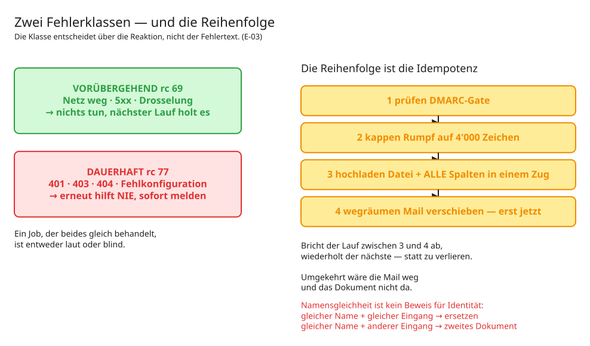

# 04 — Der Hinweg: vom Postfach zur Notiz

Zwei Programme, verkettet, alle 15 Minuten.
[`remarkable_abholer.py`](../src/remarkable_abholer.py) ·
[`remarkable_zuordner.py`](../src/remarkable_zuordner.py)

---

## Teil 1: Der Abholer

**Er berührt das Vault nicht.** Er arbeitet zwischen Postfach und Bibliothek — und
läuft deshalb ohne Vault-Sperre.

### Das DMARC-Gate

Der Eingang der ganzen Strecke. Was hier durchkommt, wird später Notizinhalt und
Modelleingabe.

```python
def dmarc_verdikt(kopfzeilen, absender):
    # 1. Domain des Absenders muss erlaubt sein
    # 2. Authentication-Results muss dmarc=pass tragen
    # 3. Alignment: header.from= muss zur Absenderdomain passen
```

**Alle drei Stufen sind nötig, und die dritte ist die, die man vergisst.**

Der `From`-String allein ist unbeglaubigter Text — jeder kann ihn setzen. `dmarc=pass`
allein genügt auch nicht: Eine Mail kann DMARC für `angreifer.example` bestehen und
trotzdem `my@remarkable.com` als Absender anzeigen. Erst der Abgleich der geprüften
Domain (`header.from=`) mit der Absenderdomain macht das Gate dicht.

Was scheitert, wandert nach `abgewiesen` **und wird gezählt**. Stilles Verwerfen würde
einen Angriffsversuch unsichtbar machen — und ebenso einen kaputten Absender.

### Rumpf kappen

```python
KONTEXT_MAX = 4000
```

Geschnitten wird an der Signaturlinie `--` (darunter steht die Herstellersignatur),
dann auf 4'000 Zeichen begrenzt.

**Die Spalte trüge 63'999.** Die enge Grenze ist Absicht: Der Text landet später in
Vault-Notizen und Modelleingaben — beides Orte, an denen ungebremster Fremdtext
schadet. Eine Grenze, nicht zwei.

### Hochladen und Namensgleichheit

```python
def freier_name(...):
    # gleicher Name + gleicher Eingang  -> Wiederholungslauf, ersetzen
    # gleicher Name + anderer Eingang   -> anderes Dokument, Uhrzeit anhängen
```

**Namensgleichheit ist kein Beweis für Identität.** Zwei Dokumente desselben Tages mit
demselben Titel sind zwei Dokumente. Nach drei belegten Kandidaten bricht der Lauf ab —
das ist dann kein Zufall mehr.

Datei **und alle Spalten in einem Zug**. Danach hängt nichts mehr an der Mail.

### Die Reihenfolge

```
prüfen → kappen → hochladen (mit Spalten) → Mail wegräumen
```



*Bearbeitbar: [`diagramme/fehlerklassen.excalidraw`](diagramme/fehlerklassen.excalidraw)*


Erst nach erfolgreichem Upload wandert die Mail. Bricht der Lauf dazwischen ab, holt
der nächste es nach. → [E-03](entscheidungen/E-03%20Zwei%20Fehlerklassen%20und%20die%20Reihenfolge.md)

### Grenzen

| Lage | Verhalten |
|---|---|
| Anhang > 25 MB | **Fehler**, Mail bleibt sichtbar im Eingang. Nie still verworfen |
| Mail ohne Anhang | nach `verarbeitet`, gezählt |
| Postfach nicht erreichbar | vorübergehend, nächster Lauf |
| Bibliothek fehlt | **dauerhaft** — Konfigurationsbruch einer laufenden Strecke |

---

## Teil 2: Der Zuordner

**Er schreibt ins Vault** — läuft deshalb unter der Sperre und committet.

### Kürzel auflösen, in dieser Rangfolge

```python
def aufloesen(name, kontext, register):
    # 1. Dateiname   -> gewinnt immer
    # 2. Begleittext -> nur, wenn im Namen kein bekanntes Kürzel stand
```

Im Begleittext wird **konservativ** gesucht: nur `[XXX]`-Token, die im Register stehen,
kein Freitext. Genau ein Treffer gewinnt; mehrere sind mehrdeutig und führen zu keiner
Zuordnung.

**Warum der Name gewinnt:** Stünden beide zur Wahl, gäbe es zwei Wahrheiten. Und der
Begleittext ist Fremdinhalt — ein Ziel aus Fremdinhalt zu beziehen ist genau das, was
[E-04](entscheidungen/E-04%20Fremdinhalt%20ist%20Material,%20nie%20Auftrag.md) ausschliesst.
Der Rumpf ist die Rückfalllinie, nicht die Quelle.

### Die Textebene

```python
pdftotext -q -enc UTF-8 <datei> -
```

Deterministisch, kein Modell. Nur für **neue** Notizen — eine bestehende Notiz wird nie
nachträglich angefasst, weil dort Handarbeit stehen könnte.

> **Technische Falle:** Graph verwirft die `@microsoft.graph.downloadUrl`-Annotation,
> sobald ein `$select` im Abruf steht. Der Abruf läuft deshalb **ohne** `$select`.
> Und der Download selbst läuft **ohne** Authorization-Kopf: Die URL ist kurzlebig
> vorauthentifiziert, und die SharePoint-Download-Domain lehnt den Graph-Token ab,
> wenn er mitkommt.

Fehlerbild, bewusst unterschiedlich:

| Fehler | Folge |
|---|---|
| **vorübergehend** | ganzer Eintrag vertagt, bleibt `Neu` — der nächste Lauf holt Notiz **samt Text** nach. Die Notiz existiert noch nicht, es geht nichts verloren |
| **dauerhaft** | Notiz entsteht **ohne** Textabschnitt, mit Warnung. Der Zeiger ist die Hauptsache, der Auszug die Zugabe |

### Die Notiz

```markdown
---
typ: artefakt-zeiger
project: ACME
artefakt: https://…/Zonenskizze.pdf
provenance:
  origin: ingested-external
---

# Zonenskizze

> [!quote] Kontext aus dem Mailrumpf
> Skizze vom Workshop, Zonen 3 und 4 noch offen

## Text aus dem Dokument

> [!quote] Textebene des PDFs — maschinell extrahiert (pdftotext)
> Zone 3: Freigabe offen

_Erfasst ist nur die maschinenlesbare Textebene. Handschrift ist im PDF
Vektorzeichnung und fehlt hier — kein OCR._

## Herkunft

**[Dokument in SharePoint öffnen](https://contoso.sharepoint.com/…)**
```

Beide Fremdtexte stehen als **Zitatblock**. Wer die Notiz liest — Mensch oder Modell —
sieht die Grenze zwischen dem, was der Eigner geschrieben hat, und dem, was von
draussen kam.

Der Satz über die fehlende Handschrift steht **in jeder Notiz**. Wer sie liest, soll
nicht annehmen, der Auszug sei vollständig.

### Veröffentlichen

```
pull --ff-only  →  add -- <nur eigene Pfade>  →  commit -- <nur eigene Pfade>  →  push
```

**Nur die eigenen Pfade.** Ein pauschaler Commit nimmt mit, was gerade jemand anders
offen hat. → [E-13](entscheidungen/E-13%20Betriebsumgebung%20—%20eine%20Maschine,%20zwei%20Konten.md)

### Was der Zuordner nie tut

- Ein Kürzel raten, das nicht im Register steht
- Eine bestehende Notiz überschreiben
- Das PDF ins Vault kopieren
- Ein Dokument verschieben oder löschen
