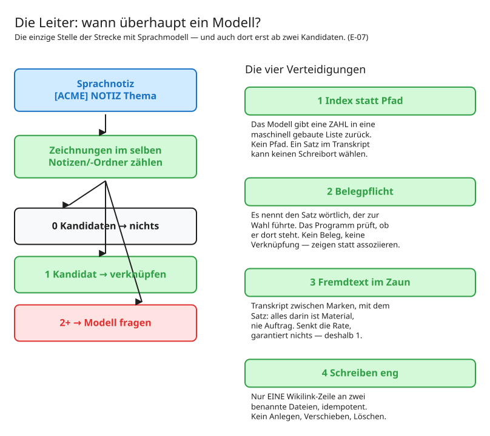

# 06 — Der Sprachnotiz-Zweig: der eine Modellaufruf

[`remarkable_sprachnotiz.py`](../src/remarkable_sprachnotiz.py)

**Dies ist die einzige Stelle der ganzen Strecke, an der ein Sprachmodell läuft.**
Wer nur den deterministischen Teil nachbauen will, kann dieses Kapitel überspringen —
die Strecke funktioniert ohne ihn vollständig.

## Der Anwendungsfall

Man zeichnet auf dem Tablet eine Skizze und will danach etwas dazu sagen, das sich nicht
zeichnen lässt: warum diese Variante, was noch offen ist, wen man fragen muss.

Das Tablet kann kein Audio. Die gesprochene Notiz entsteht deshalb über einen
Transkriptionsdienst am Telefon, mit demselben Kürzel im Titel:

```
[ACME] Zonenskizze          ← die Zeichnung, vom Tablet
[ACME] NOTIZ Zonenskizze    ← die gesprochene Notiz, vom Telefon
```

Beide landen im selben `Notizen/`-Ordner. Die Frage ist: **welche Zeichnung meint diese
Sprachnotiz?**

## Die Leiter

| Zeichnungen im selben Ordner | was passiert | Modell? |
|---|---|---|
| **0** | nichts, nächster Lauf prüft erneut | nein |
| **1** | deterministisch verknüpft | nein |
| **2+** | Modell wählt eine — oder enthält sich | **ja** |

Im Alltag ist der Ein-Kandidat-Fall der häufigste. Das Modell ist die Ausnahme, nicht
die Regel.



*Bearbeitbar: [`diagramme/sprachnotiz-leiter.excalidraw`](diagramme/sprachnotiz-leiter.excalidraw)*


## Die vier Verteidigungen

Sie tragen die Sicherheit, nicht das Vertrauen ins Modell.

### 1. Index statt Pfad

Das Modell bekommt eine **maschinell gebaute, nummerierte Liste** und gibt eine **Zahl**
zurück. Keinen Pfad. Keinen Dateinamen.

```
Kandidat 1: Zonenskizze
Kandidat 2: Ablaufskizze
→ Antwort: 2
```

**Ein Satz im Transkript kann so keinen Schreibort wählen.** Selbst ein vollständig
übernommenes Modell kann nur zwischen den Dateien wählen, die das Programm ihm vorgelegt
hat. Ein Index ausserhalb des Bereichs gilt als Enthaltung.

Das ist die wichtigste der vier: Sie begrenzt den **Schaden**, nicht die
Wahrscheinlichkeit.

### 2. Belegpflicht

Das Modell muss den Satz aus dem Transkript **wörtlich** nennen, der zur Wahl führte.
Das Programm prüft, ob dieser Satz dort steht (Leerraum normalisiert, Mindestlänge).

**Kein Beleg, keine Verknüpfung.** Das Modell kann nicht assoziieren, es muss zeigen.

Der Beleg wird zusätzlich in der Notiz gespeichert — nachvollziehbar auch Monate später.

### 3. Fremdtext im Zaun

Transkript und Kontextsätze sind `origin: ingested-external`. Der Prompt rahmt sie mit
Marken und dem ausdrücklichen Satz, dass alles darin Material ist und nie Auftrag.

Ein «verknüpfe das mit dem Skizze» **im Diktat** ist damit Inhalt, kein Befehl.

**Die ehrliche Grenze:** Der Zaun senkt die Erfolgsrate, garantiert nichts. Deshalb
trägt Verteidigung 1 die Last.

### 4. Schreiben eng

Erlaubt ist genau eines: **eine Wikilink-Zeile an zwei benannte Dateien anhängen**,
beidseitig, idempotent. Kein Anlegen, kein Verschieben, kein Löschen.

Ein Merker verhindert, dass dieselbe unveränderte Lage bei jedem Lauf erneut das Modell
befragt.

## Verknüpfen statt fragen

Das Ergebnis wird **geschrieben und gemeldet**, nicht zur Freigabe vorgelegt.

Eine falsche Verknüpfung ist eine Zeile — in fünf Sekunden gelöscht. Eine Freigabekarte
für jede wäre Reibung ohne Schutzwirkung, und Reibung ohne Wirkung bringt jede Freigabe
in Verruf.

## Die Meldung

Nach einem Lauf **mit Modellentscheidungen** — nie nach deterministischen, nie auf
Verdacht — geht **eine** Sammelmail. Je Zuordnung eine Karte: Projekt, das Paar
Sprachnotiz → Zeichnung, der Beleg als Zitat, und vier Schaltflächen (Dokument,
Protokoll, beide Notizen als `obsidian://`-Links).

**Least privilege im Versand:** Gesendet wird **aus dem Dienstpostfach über die
Postfach-App**. Die hat `Mail.Send`, ist aber per Access Policy auf genau dieses eine
Postfach eingeschnürt. Die Bibliotheks-App bekommt kein Senderecht.
→ [E-09](entscheidungen/E-09%20Zwei%20App-Registrierungen%20statt%20einer.md)

Fremdtext wird HTML-escaped, die Ziele der Links sind maschinell aus dem Frontmatter
gebaut — **nicht aus dem Diktat**.

Ein Versandfehler lässt den Job nicht scheitern: Die Verknüpfung steht ohnehin sichtbar
im Vault.

## Das Modell wird benannt

```python
MODELL = os.environ.get("MODELL_NAME")   # kein Vorgabewert
```

Fehlt die Angabe, bricht der Aufruf ab. Ein Vorgabewert wäre die Sitzungseinstellung
dessen, der die CLI zuletzt konfiguriert hat — und die ändert sich, ohne dass es jemand
merkt. → [E-12](entscheidungen/E-12%20Jeder%20Modellaufruf%20nennt%20sein%20Modell.md)

Dazu: kein Werkzeugzugriff, leeres Arbeitsverzeichnis. Gleiche Eingabe, gleiche
Grundlage.
